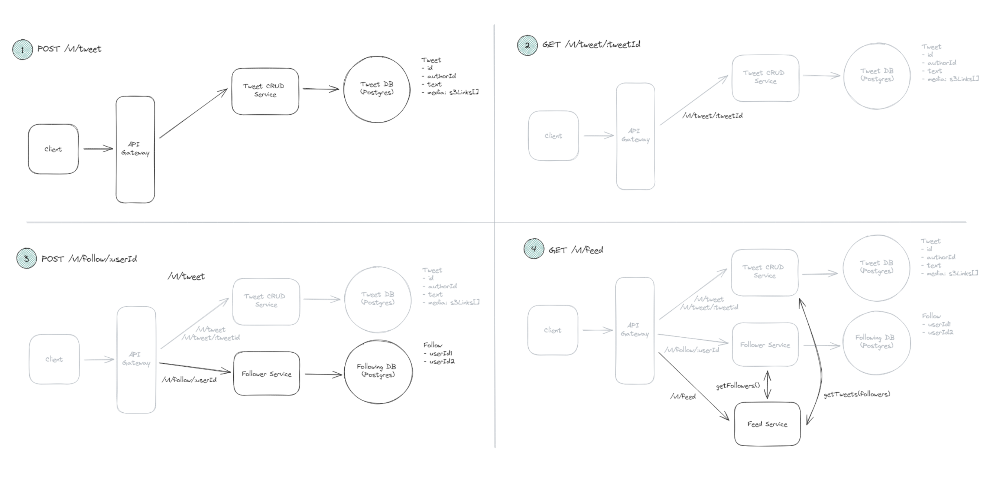

# Delivery framework

1. `Requirements` (5 min)
    - `Functional` ("Clients should be able to...")
        - Ask questions about the features as if you were talking to a client or PM
        - ! Identify and prioritize the top 3
    - `Non-functional` (System qualities. "The system should be...")
        - "System should be highly available", "The system should be able to scale to support 100M+ DAUs", "The system should be low latency, rendering feeds in under 200ms"
        - ! Important to have requirements in the context of the system and quantify if possible
        - Identify top 3 - 5 things among:
        - `PACELC Theorem`: Consistency vs Availability
            - AP should be the default choice. Only need strong consistency in systems where reading stale data is unacceptable
            - E.g. for strong consistency: inventory mgmt systems, booking systems, banking systems
            - ! You can have more than one consistency models in your system. That is, you can provide product description with AP but CP inventory counts to prevent overselling
            - Remember, you prioritize consistency over availability only if every read must receive the most recent write; otherwise, the system will break. For example, with a stock trading app, if a user buys a share of APPL in Germany and then another user immediately tries to buy a share of APPL in the US, you need to be sure that the first transaction has been replicated to the US before you can proceed. However, for a file storage system like Dropbox, it's okay if a user in Germany uploads a file and a user in the US can't see it for a few seconds.
        - `Environment Constraints`: System with limited memory or limited bandwidth (e.g. streaming video on 3G)?
        - `Scalability`: All systems should scale. But more specifically stuff like bursty traffic at a specific time/day? Does your system need to scale reads or writes more?
        - `Latency`: Specifically consider any requests that require meaningful computation. For example, low latency search when designing Yelp.
        - `Durability`: Data loss tolerance? social network vs. banking system 
        - `Compliance/Security`: Regulatory requirements. Data loss, access control, etc.
    - `Capacity` (Calculation/estimation)
        - Often unnecessary unless it's crucial for non-functional requirement
        - ! Tell them you'll skip calculation and do it while designing if necessary
        - https://www.hellointerview.com/blog/mastering-estimation
2. `Core entities` (2 min)
    - Identify and list the core entities of your system. Nouns and verbs. Small list.
    - Twitter example: "User" "Tweet" "Follow"
    - ! Think of the non-overlapping actors and what are necessary for the functional requirements
3. `API` (5 min)
    - Based on the functional req, define the contract between users and the system. Guides the high-level design
    - types
        - `REST API`: Basic CRUD. Bias towards this. Only nouns. No verbs
        - `GraphQL`: Use only if it's imperative for the client to fetch exactly the data they need (no over- or under- fetching)
        - `Wire protocol`: websockets, raw TCP
    - REST example:
        - POST /v1/tweets
            body: {
                "text": str
            }
          GET /v1/tweets/{tweetId} -> Tweet
          POST /v1/follows/{userId}
          GET /v1/feeds -> Tweet[]
        - Notice there's no userid in the tweet POST since it'll be identified using authentication token in req header
        - fyi, those things after : is called path parameter 
4. `Data flow` (Optional, 5 min)
    - If we're talking about data processing systems with many steps, helpful to list of sequence of actions/processes
    - Web crawler example:
    - For a web crawler, this might look like:
        1. Fetch seed URLs
        2. Parse HTML
        3. Extract URLs
        4. Store data
        5. Repeat
5. `High level diagramming` (10 - 15min) 
    - ! Primary goal: Satisfy functional requirements by satisfying the designed API
    - Don't overthink/over-complicate since you need to at least complete the system. Go one by one of the API endpoints
    - ! Be explicit about data flows. Starting from request and ending with response. When request reaches DB, doc relevant col/fields for the entity (Not too detailed. Wastes time.)
      - That is, for POST tweet, next to the DB, you can jot down
        - Tweet
          - id
          - userid
          - text
          - media: s3uri[]
    - Take notes of potential areas of complexity for the deep dives section
    - example diagram: 
6. `Deep Dives` 
    - ! Harden design
        - Meeting non-functional req (go back and check each point)
        - Address edge case
        - Identifying & addressing issues & bottlenecks